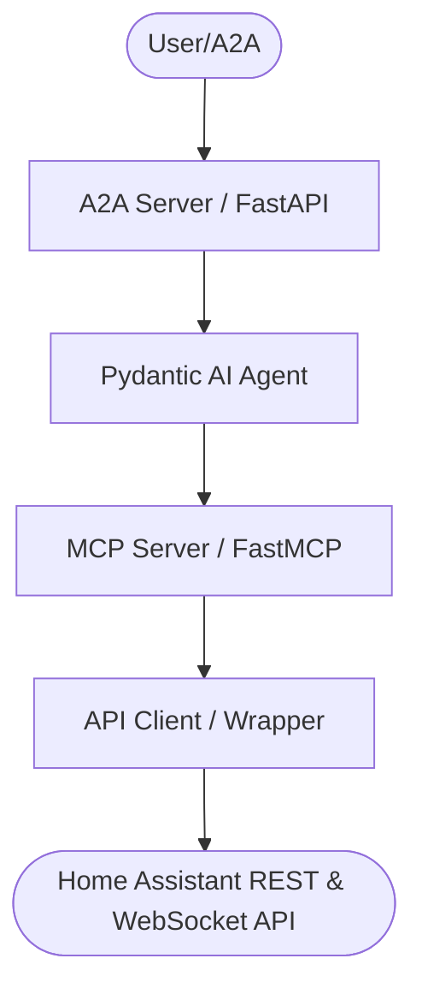
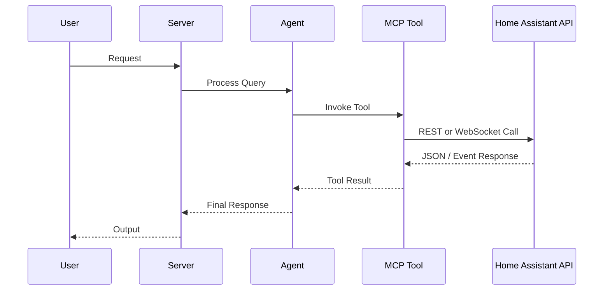

# AGENTS.md

## Tech Stack & Architecture
- Language/Version: Python 3.10+
- Core Libraries: `agent-utilities`, `fastmcp`, `pydantic-ai`
- Key principles: Functional patterns, Pydantic for data validation, asynchronous tool execution.
- Architecture:
    - `mcp_server.py`: Main MCP server entry point and tool registration.
    - `agent_server.py`: Pydantic AI agent server and run configuration.
    - `auth.py`: Authentication client singleton.
    - `api/`: Multi-protocol client backend (REST and WebSocket APIs).

### Architecture Diagram


### Workflow Diagram


## Commands (run these exactly)
# Installation
```bash
pip install .[all]
```

# Quality & Linting (run from project root)
```bash
uv run ruff check .
uv run ruff format --check .
```

# Execution Commands
# Run MCP Server
```bash
home-assistant-mcp
```
# Run Agent
```bash
home-assistant-agent
```

## Project Structure Quick Reference
- MCP Entry Point → `home_assistant_agent/mcp_server.py`
- Agent Entry Point → `home_assistant_agent/agent_server.py`
- Source Code → `home_assistant_agent/`

### File Tree
```text
├── .bumpversion.cfg
├── .dockerignore
├── .env.example
├── .gitattributes
├── .gitignore
├── .pre-commit-config.yaml
├── AGENTS.md
├── CHANGELOG.md
├── Dockerfile
├── LICENSE
├── MANIFEST.in
├── README.md
├── compose.yml
├── debug.Dockerfile
├── home_assistant_agent/
│   ├── __init__.py
│   ├── __main__.py
│   ├── agent/
│   │   ├── AGENTS.md
│   │   ├── CRON.md
│   │   ├── CRON_LOG.md
│   │   ├── HEARTBEAT.md
│   │   ├── IDENTITY.md
│   │   ├── MEMORY.md
│   │   ├── USER.md
│   │   └── icon.png
│   ├── api/
│   │   ├── __init__.py
│   │   ├── api_client_base.py
│   │   ├── api_client_rest.py
│   │   └── api_client_websocket.py
│   ├── agent_server.py
│   ├── api_client.py
│   ├── auth.py
│   ├── home_assistant_models.py
│   ├── main_agent.json
│   ├── mcp_config.json
│   └── mcp_server.py
├── pyproject.toml
├── requirements.txt
└── tests/
    ├── conftest.py
    ├── pytest.ini
    ├── test_concept_parity.py
    ├── test_coverage.py
    ├── test_init.py
    └── test_startup.py
```

## Concept Registry & Traceability

This repository aligns perfectly with the standard `agent-utilities` architecture pillars:

### `CONCEPT:ECO-4.0` — Tool Interface & MCP Factory
Defines all 11 action-routed MCP tools: Config, States, Services, Events, History, Logbook, Calendar, Panels, Voice, Entities, and System.
- **Source Files:**
  - [mcp_server.py](file:///home/apps/workspace/agent-packages/agents/home-assistant-agent/home_assistant_agent/mcp_server.py)
  - [api_client_rest.py](file:///home/apps/workspace/agent-packages/agents/home-assistant-agent/home_assistant_agent/api/api_client_rest.py)
  - [api_client_websocket.py](file:///home/apps/workspace/agent-packages/agents/home-assistant-agent/home_assistant_agent/api/api_client_websocket.py)
- **Tests:**
  - [test_coverage.py](file:///home/apps/workspace/agent-packages/agents/home-assistant-agent/tests/test_coverage.py#L285-L670)

### `CONCEPT:OS-5.0` — Operating System and Agents
Directs the lazy loader, entry points, and CLI runtime interface.
- **Source Files:**
  - [__init__.py](file:///home/apps/workspace/agent-packages/agents/home-assistant-agent/home_assistant_agent/__init__.py)
  - [__main__.py](file:///home/apps/workspace/agent-packages/agents/home-assistant-agent/home_assistant_agent/__main__.py)
  - [agent_server.py](file:///home/apps/workspace/agent-packages/agents/home-assistant-agent/home_assistant_agent/agent_server.py)
- **Tests:**
  - [test_init.py](file:///home/apps/workspace/agent-packages/agents/home-assistant-agent/tests/test_init.py)
  - [test_startup.py](file:///home/apps/workspace/agent-packages/agents/home-assistant-agent/tests/test_startup.py)
  - [test_coverage.py](file:///home/apps/workspace/agent-packages/agents/home-assistant-agent/tests/test_coverage.py#L209-L229)

### `CONCEPT:OS-5.1` — Security & Auth
Credentials and authentication client setup.
- **Source Files:**
  - [auth.py](file:///home/apps/workspace/agent-packages/agents/home-assistant-agent/home_assistant_agent/auth.py)
  - [api_client_base.py](file:///home/apps/workspace/agent-packages/agents/home-assistant-agent/home_assistant_agent/api/api_client_base.py)
- **Tests:**
  - [test_coverage.py](file:///home/apps/workspace/agent-packages/agents/home-assistant-agent/tests/test_coverage.py#L230-L263)

### `CONCEPT:ORCH-1.5` — Orchestration Workflows/Agents
Pydantic AI Graph Agent configuration.
- **Source Files:**
  - [agent_server.py](file:///home/apps/workspace/agent-packages/agents/home-assistant-agent/home_assistant_agent/agent_server.py)
- **Tests:**
  - [test_coverage.py](file:///home/apps/workspace/agent-packages/agents/home-assistant-agent/tests/test_coverage.py#L264-L284)

## Code Style & Conventions
**Always:**
- Use `agent-utilities` for common patterns (e.g., `create_mcp_server`, `create_agent_server`).
- Define input/output models using Pydantic.
- Include descriptive docstrings for all tools (they are used as tool descriptions for LLMs).
- Check for optional dependencies using `try/except ImportError`.

## Dos and Don'ts
**Do:**
- Run lint/test via `uv run ruff check .` and `pytest`.
- Use existing patterns from `agent-utilities`.
- Keep tools focused and idempotent where possible.

**Don't:**
- Use `cd` commands in scripts; use absolute paths or relative to project root.
- Add new dependencies to `dependencies` in `pyproject.toml` without checking `optional-dependencies` first.
- Hardcode secrets; use environment variables or `.env` files.

## Safety & Boundaries
**Always do:**
- Run lint/test via `pre-commit`.
- Use `agent-utilities` base classes.

**Ask first:**
- Major refactors of `mcp_server.py` or `agent_server.py`.
- Deleting or renaming public tool functions.

**Never do:**
- Commit `.env` files or secrets.
- Modify `agent-utilities` or `universal-skills` files from within this package.

## When Stuck
- Propose a plan first before making large changes.
- Check `agent-utilities` documentation for existing helpers.

## ⛔ No Scratch or Temporary Files in Repository

**NEVER write any of the following to this repository:**
- Temporary test scripts (`test_*.py`, `debug_*.py` outside of `tests/`)
- Scratch scripts or experimental one-off files
- Log files (`.log`, `.txt` command output)
- Random text files with command output or debug dumps
- Any file that is NOT production source code, tests in `tests/`, or documentation

**Why:** These files expose private filesystem paths, credentials, and internal infrastructure details when pushed to GitHub publicly.

**Where to put scratch work instead:**
- Use `~/workspace/scratch/` for temporary scripts and experiments
- Use `~/workspace/reports/` for command output and reports
- Keep test scripts in the `tests/` directory following proper pytest conventions
